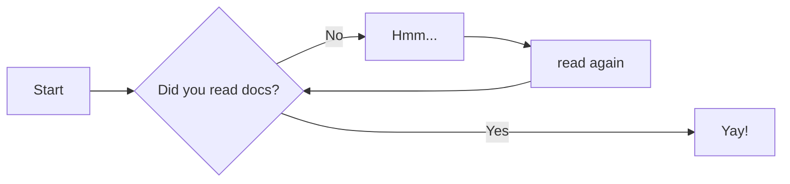

# Contributing To The Wiki

The underlying Github repo can be [located here](https://github.com/Brickadia-Community-wiki/brickadiacommunitywiki). 

## Contributer Guidelines
The following guidelines should be kept in mind when submitting changes:

- Our audience is international based, so use clear and precise language, avoiding slang or acronyms without explanation.
- Do not provide guides to facilitate illegal activity.
    - This includes but is not restricted to: Piracy, hacking, or otherwise exploiting software in an illegal manner. 
- Keep your writing tone non-biased and professional.
- if you upload any images, please try to keep them below 2 Megabytes in size. 


## Text Formatting Examples
### Markdown

[link to another wiki page](about.md)

[link to another page and section](about.md#about-this-site)

*Italic*

**Bold**

***Bold Italic***

^^Underlined^^

> Quote Indent

Tables:

| First Header | Second Header | Third Header |
| ------------ | ------------- | ------------ |
| Content Cell | Content Cell  | Content Cell |
| Content Cell | Content Cell  | Content Cell |


`single code line`


```
multi line
codeblock
```


```python
print("Multi line codeblock")
print("with lang specific syntax highlighting")
```
Local Image Embed


Remote Image Embed with scaling

{ width="200" }

[comment]: <> (This is a hidden markdown comment that will not visibly show on the site)


### Material Theme Extended Markdown
The material theme provides extended features for markdown.
See the [official reference page](https://squidfunk.github.io/mkdocs-material/reference/) for extended examples. 


!!! note "note admonition"
    sample note
    with helpful info

??? note "collapsable note admonition"
    sample note
    with helpful info

!!! warning "warning admonitions"
    sample warning


Diagram using Mermaid syntax



### HTML
MkDocs supports basic HTML tag formatters as an alternative to markdown. Markdown cannot be used inside of an HTML tag block, only on the outside. 

**<p style="text-align:center">Notice: Notice text example</p>**

**<p style="text-align:center;color:red">Warning: Warning Text Example</p>**


