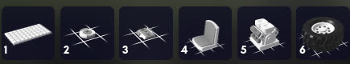
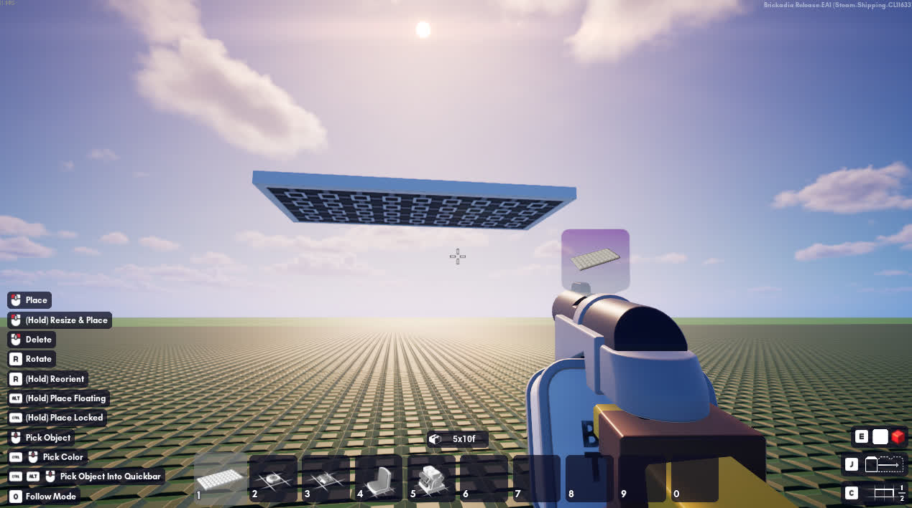
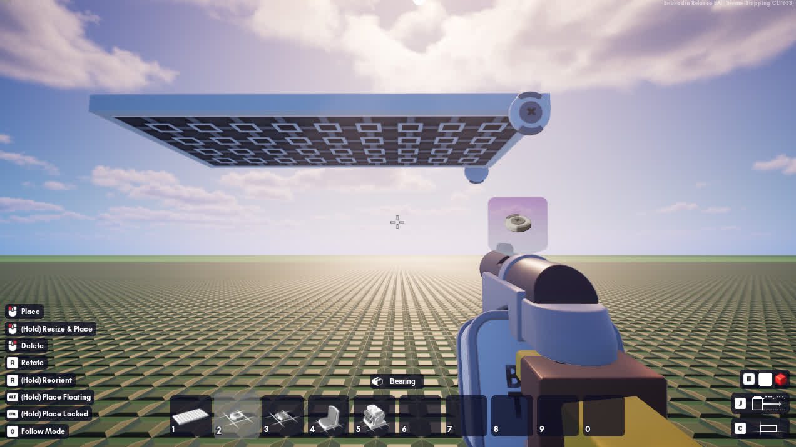
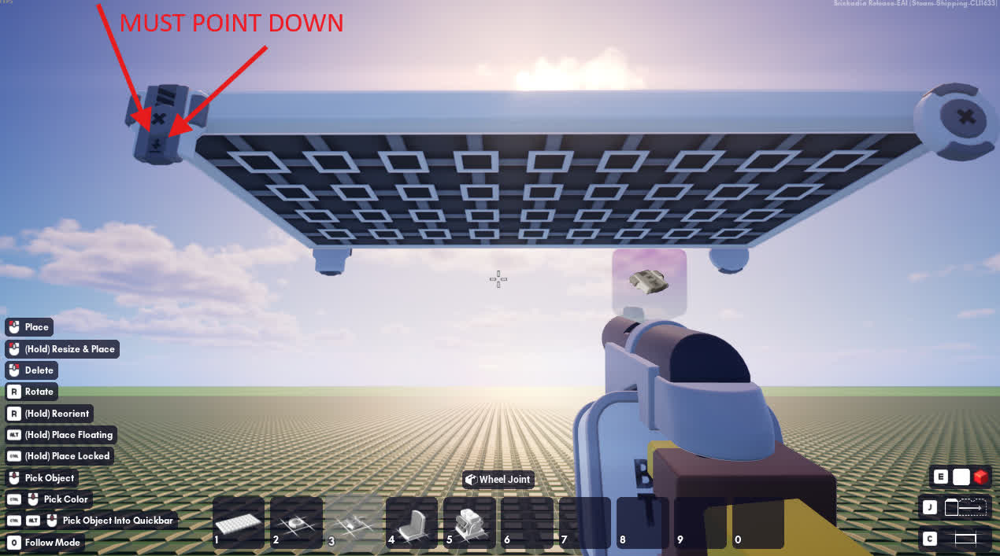
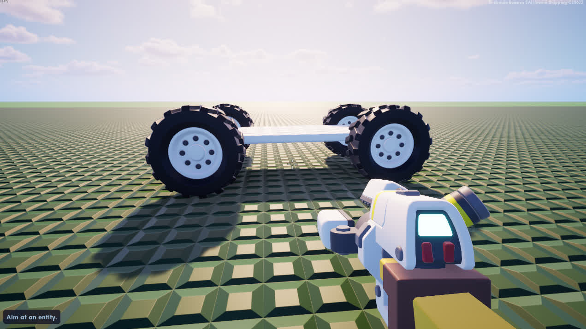
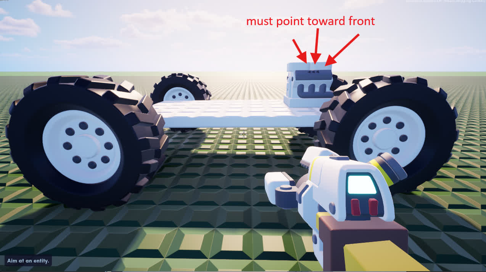
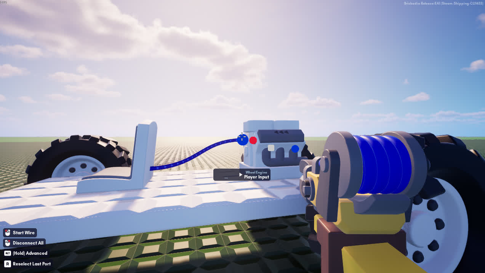
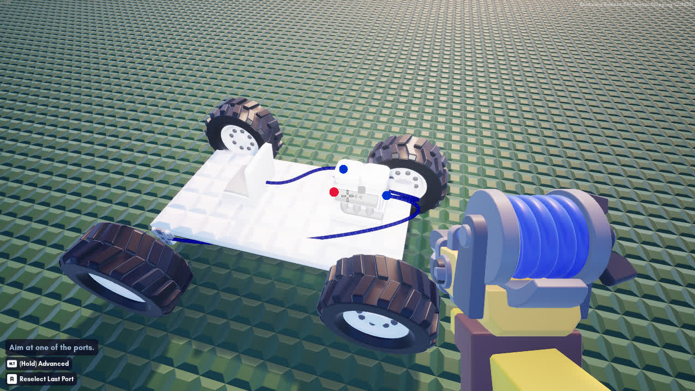
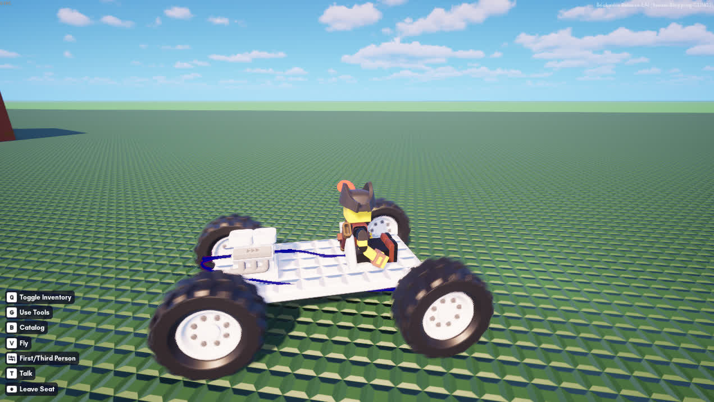

# Brickadia Vehicle Basics
This guide aims to teach the basics of how to make a simple vehicle to get around in within Brickadia. 

## The Basic Car
To build a basic car you will need:

- Plates -> 5x10f plate
- Physics -> Bearing
- Physics -> Wheel Joint
- Mechanics -> Seat
- Mechanics -> Wheel Engine
- Physics -> Wheels > Off-Road A

 

1. place the 5x10f plate in mid air a bit above the ground so we have room to build where the wheels will attach (hold alt to midair build)

1. use the G key to choose the Selector Wand
1. Click the 5x10f plate you placed earlier, and press U to make it a physics object
1. hold G and choose the manipulator
1. left click and drag the plate into the air, then right click to lock it in place. If you have done this correctly, it should look like this again

1. choose the bearing, then place one on each corner of what will be the **rear** of the vehicle

1. choose the Wheel Joint, then place those on the front of the vehicle, **making sure that the arrows point downward**

1. select your Off-Road A wheel, then place them on all 4 points on front and back
1. equip the manipulator, then left click the 5x10f plate to unfreeze it. your car body should fall to the ground.

1. Select the Wheel Engine, and place it at the rear of the vehicle with the arrow pointing towards the front

1. place the Seat at the front of the vehicle where you would like to sit
1. equip the connector tool, then hover over the connection points over the engine until you see one called **Player Input**, and click it
1. attach this point to the blue point on the Seat 

1. hover over the Wheel Engine, and now find the point called **Control-Drive & Steer**
1. click this point, and connect it to the blue points on the front of the vehicle. 

    ??? note "Protip"
        If you cannot find the blue connection points on the Wheel Joints on the front, you may need to detach your front wheels temporarily to wire up the connections.

1. Hop in the front seat and drive!

You can experiment from here using the applicator on the Wheel Engine and the Wheel Joints to tweak settings on how the car operates as well as the distance the wheels stick out from the Wheel Joints. Have fun experimenting!
