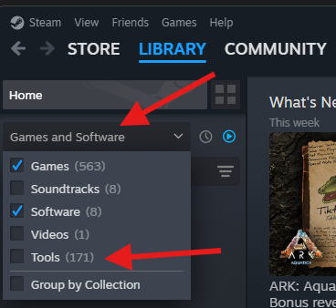
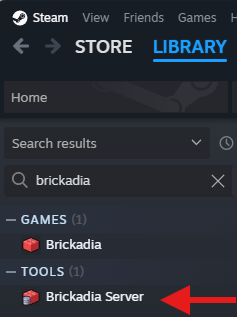
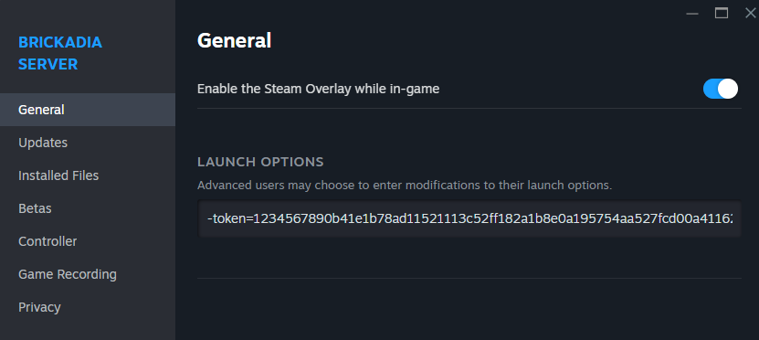
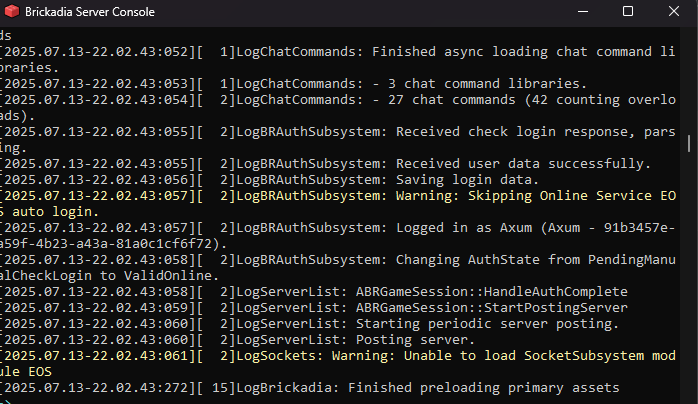

# Windows Dedicated Server Guide
So you want to use a linux server but dont know where to start? This guide is for you.

## Prereqs (Steam Early Access Edition)
You will need:

- a windows PC with at least of 8 GB of RAM (16 GB if you intend on using the same PC you play the game on)
- a copy of Brickadia
- ability to port forward udp port 7777
- a public IP address

## Steam Dedicated Server Method

1. Sign in and open up Steam
1. Go to your Library
1. In the upper left corner, choose **Games and Software**, then checkmark **Tools**

1. scroll down or search for **Brickadia** in your steam library. You should now see two items:
    - Brickadia
    - Brickadia Server
 
1. Install the **Brickadia Server** item
1. Go to <https://brickadia.com/account> and login, then generate a server hosting token. copy this somewhere
1. Once the brickadia server is done installing, right click the Brickadia Server item, then choose **Properties**
1. Be sure you have the **General** tab on the left selected
1. Under LAUNCH OPTIONS, put `-token=ReplaceMe`, then change the `ReplaceMe` to be the token you copied several steps earlier. You now should have a similar entry as the one pictured below.

1. Once you have entered this in, simply close the window using the X in the upper right corner
1. Now launch the brickadia server
1. If done correctly, you should have a window like the following:

1. Now launch your normal Brickadia game on the computer you will be playing from
1. Click **Join Game** then **Manual Connect**
    - If the brickadia server is on the same machine as the game, use the default 127.0.0.1 address to connect.
    - if the brickadia server is on a different machine, you will need to locate the IP address of the server,
    then fill out the IP address in the Manual Connect window.
1. Open up the game menu (This is usually bound to the Esc key)
1. Set your server info, description, password (if needed) and any other info. Then hit Save
1. Back at your brickadia server terminal window, type `exit` to exit the server. 
1. Browse to `%localappdata%\Brickadia\Saved\Config\WindowsServer`
1. In this directory, review your server settings within this file.
1. If all settings look good, save the file. 
1. Verify now that you have port forwarded udp port 7777
1. Start the Brickadia server again from Steam. 

## Post-Setup Configuration Tips
#### Enable Auto Save
1. In your server console, type `BR.World.SaveAs savename` (where savename is what you want the name of your save to be). This will create your save file for the server. 
      - Note: If you do not run this command, the Auto Save won't function.
      - If you already created a save file for your server, you can skip this step.
2. Connect to your server in game, press the escape key to open the menu -> edit game
3. Click the advanced settings toggle at the top left of the menu
4. Scroll to the bottom and enable Auto Save. You can also configure save interval and announcing of the saves.
5. Whenever you restart your server, you will need to run `BR.World.Load savename` to have the server reload the save file.